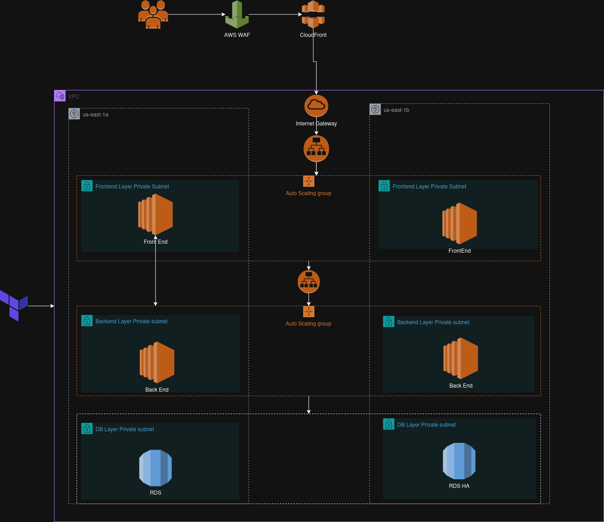

# 🌐 3-Tier Web Application Infrastructure

This project demonstrates the deployment of a scalable and secure 3-tier web application architecture using Terraform on AWS. The infrastructure is designed to ensure high availability, scalability, and security, leveraging AWS services such as VPC, EC2, RDS, and ALB.

## Project Overview

The project orchestrates the deployment of a Virtual Private Cloud (VPC) with public and private subnets, setting up internet gateways, and configuring public and private route tables. It includes:

- Deployment of frontend, backend, and database layers.
- Use of Terraform modules for modular and reusable infrastructure.
- High availability setup with multi-AZ deployments.
- Secure access with SSH key management.



## 🚀 Getting Started

### Prerequisites 🛠️

Before you begin, ensure you have the following installed:

- Terraform 🏗️
- AWS CLI ☁️
- Git 🐙

### How To Configure AWS Credentials 🔑

1. Open a terminal window.
2. Run the following command:

    ```bash
    aws configure
    ```

3. Enter the following information:
    AWS Access Key ID
    AWS Secret Access Key
    Default region name (e.g., us-east-1)
    Default output format (e.g., JSON)

### How to Get AWS Access Key ID & AWS Secret Access Key 🔑

- Log in to your AWS account.
- Click on your account name in the top right corner.
- Hover over "Security Credentials."
- Find "Access keys" and click "Create Access key."
- Copy and paste the AWS Access Key ID & AWS Secret Access Key into the terminal after running 'aws configure'.

---- 🌟 ----

### Infrastructure Setup

- Clone the Repository:

```bash
    git clone https://github.com/Hendawyy/AlgoCASTask1.git
    cd AlgoCASTask1
```

- Initialize Terraform:

```bash
terraform init
```

- Plan the Deployment:

```bash
    terraform plan -var-file="secrets.tfvars"
```

Apply the Configuration:

```bash
    terraform apply -var-file="secrets.tfvars"
```

Review the plan output carefully before applying to ensure all changes are as expected.

---- 🌟 ----

### Architecture Components

1. VPC and Subnets: A VPC with public and private subnets across multiple availability zones.
2. NAT Gateway: Provides internet access for instances in private subnets.
3. Application Load Balancer (ALB): Distributes incoming traffic to frontend instances.
4. Auto Scaling Groups (ASG): Ensures scalability for frontend and backend layers.
5. RDS MySQL Database: Multi-AZ deployment for high availability.
6. Security Groups
7. ALB Security Group: Allows inbound HTTP traffic from the internet.
8. Frontend Security Group: Allows traffic from the ALB.
9. Backend Security Group: Allows traffic from the frontend.
10. Database Security Group: Allows traffic from the backend.

---- 🌟 ----

### Key Management

SSH Key Pair: A new SSH key pair is generated for secure access to EC2 instances. The private key is stored locally.

---- 🌟 ----

Questions or Need Help?
If you have any questions, suggestions, or need assistance, please don't hesitate to contact Me [Seif Hendawy](mailto:seif.hendawy@intern.algocas.com). 😉
